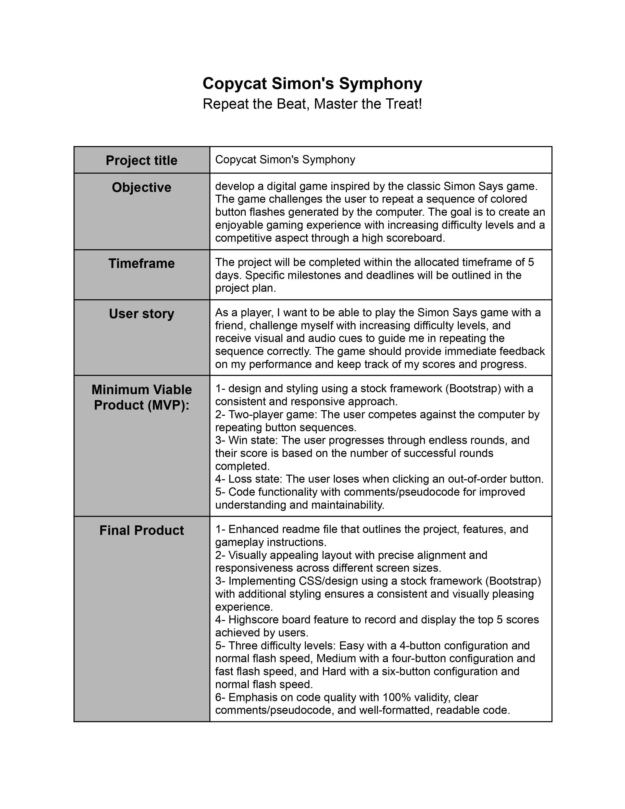

# CopycatSimonsSymphony
# Copycat Simon's Symphony
**Repeat the Beat, Master the Treat!**
Copycat Simon's Symphony: A fun and challenging Simon Says game with a musical twist. Test your memory and rhythm skills by repeating sequences and mastering the beat!

Copycat Simon's Symphony is a digital game inspired by the classic Simon Says game. The objective of the game is to repeat a sequence of colored button flashes generated by the computer. The game provides visual and audio cues to guide the player in reproducing the sequence correctly. The goal is to achieve the highest score and compete with other players on the high scoreboard.

## Installation

To install and set up the game, follow these steps:

1. Clone the repository to your local machine.
2. Open the project folder in your preferred code editor.
3. Open the `index.html` file in a web browser.

Note: The game requires an internet connection to load external dependencies and resources.

## User Manual

The User Manual section provides detailed instructions on how to play Copycat Simon's Symphony. Follow the steps below to enjoy the game:

### 1. Copycat Simon's Symphony
Once you open the game, you will be directed to the main menu.

### 2. starting the game
You can start your session by clicking the play button.

### 3. count down
The countdown will start before starting the game. make sure you are ready.

### 4. Watch and remember!
The app will start playing the sequence by flashing colors and playing sound. It would be best if you memorized the generated sequence!

### 5. Repeat the beat!
Please click on the colors in the correct order as they are generated by the app.

### 6. Current Round Score
The score for the current round will be displayed in this section.

### 7. Highest session score.
Your highest score for the current session can be found in the top left corner.

### 8. Scores Screen
If you happen to click on the wrong element, you will be shown your current score and the highest score you have achieved in this session.

### 9. congratulations Maestro
Congratulations on achieving one of the top 5 scores! Please write down your name to register it in the hall of Fame. Keep rythming!

### 10. Copycat Hall of Fame
The Copycat Hall of Fame showcases the highest scores and names of the top 5 players. You can attempt to surpass these scores.

### 11. Share the Fun
To share this app with your friends, simply click on the "Share the Fun" button this will copy a message to your clipboard

### 12. Share alert
This alert will notify you that the message has been copied to your clipboard.

### 13. Try Again Button
This will allow you to play another round within the same session.

## Developer Guide

### Architecture

Copycat Simon's Symphony is a client-side web application built using HTML, CSS, and JavaScript. It follows a single-page application (SPA) architecture, where different sections of the game are dynamically shown or hidden based on user interactions.

### Design Principles

The following design principles were followed during the development of Copycat Simon's Symphony:

1. **Modularity**: The code is organized into separate modules and components, each responsible for a specific functionality or feature of the game. This promotes code reusability and maintainability.

2. **Separation of Concerns**: The HTML, CSS, and JavaScript code are kept separate, following the best practices of front-end development. This allows for easier management and understanding of each layer.

### Key Algorithms

1. **Coloring the Game Title**: The coloring algorithm is responsible for dynamically styling the game title in the main menu. It applies different colors to each letter of the game title, creating an eye-catching visual effect.

2. **Playback Sequence**: The playback sequence algorithm visually and audibly plays back the generated sequence of button presses to the player. It utilizes timeouts to create delays between each button press, ensuring a clear and understandable pattern for the player to follow.

3. **User Input Validation**: The user input validation algorithm checks whether the user's input matches the generated sequence. It compares the user's input with the corresponding elements in the sequence array, ensuring accuracy and detecting any mistakes made by the player.

### Data Structures

1. **Game State**: The game state data structure keeps track of important information about the current state of the game, such as whether it is the player's turn, the current score, and the generated sequence. It allows for efficient management and manipulation of game-related data.

2. **Leaderboard**: The leaderboard data structure stores the top scores achieved by different players. It typically consists of an array of objects, where each object represents a player's username and score. The leaderboard is updated whenever a player achieves a high score and enters their username.

### Code Organization

The codebase is organized as follows:

- **index.html**: This is the main HTML file that contains the structure of the game's user interface. It includes links to external CSS and JavaScript files and defines the different screens and components of the game.

- **main.js**: This JavaScript file contains the logic for handling user interactions, generating random sequences, checking user input, and managing game state. It also includes functions for displaying screens, playing sounds, and handling form submissions.

- **style.css**: This CSS file defines the styles and layout of the game's user interface. It includes global styling, header styling, main menu styling, game play styling, score screen styling, scoreboard styling, and other relevant styles.

### Important Modules or Components

The following are important modules or components used in Copycat Simon's Symphony:

- **Header**: The header component contains the game's logo and high score display.

- **Main Menu**: The main menu component is responsible for displaying the game's title and a "Play" button. It handles the transition to the game play screen when the button is clicked.

- **Countdown Screen**: The countdown screen component displays a countdown animation before the game starts. It provides a visual cue to the player and creates anticipation.

- **Game Play Screen**: The game play screen component displays the circular buttons representing different colors. It manages the playback of the sequence and captures user input.

- **Score Screen**: The score screen component shows the current score and high score achieved by the player during the game. It appears after the player's turn ends.

- **Congratulations Screen**: The congratulations screen component appears when the player achieves a high score and allows them to enter their username for the leaderboard.

- **Scoreboard Screen**: The scoreboard screen component displays the top scores achieved by different players. It provides a leaderboard view and options to try the game again or share it.

These are the key aspects of the architecture, design principles, algorithms, data structures, code organization, and important modules or components used in Copycat Simon's Symphony. Understanding these will help you navigate and enhance the game's codebase effectively.

## Agile Scrum Documentation

The development process for Copycat Simon's Symphony followed the Agile Scrum methodology. The following documents were created during the planning process:

- ### Project Brief Document :
Provides an overview of the project, objectives, timeframe, user stories, and minimum viable product (MVP).

 ### Goals
Outlines the project goals and specific objectives for each sprint.

### Sprints Key Aspects
 Describes the main aspects and tasks for each sprint.

### Sprints Tasks:
 Lists the tasks assigned to each sprint.
### Wireframes:
 Visual representations of the game's interface and flow.

## Testing Documentation

A comprehensive testing process was followed to ensure the functionality, usability, compatibility, and performance of the game. The testing documentation includes:

- Testing Objectives: Specifies the objectives and goals of the testing phase.
- Test Plan: Outlines the testing approach, methodologies, and test cases executed.
- Defect Reports: Describes the identified defects, including their severity, priority, and recommendations for resolution.
- Test Summary Report: Provides an overview of the testing efforts, results, and recommendations.

Please refer to the respective testing documents for detailed information on the testing process and outcomes.

## Contributing

If you would like to contribute to the development of Copycat Simon's Symphony, please follow the guidelines outlined in the [CONTRIBUTING.md](CONTRIBUTING.md) file.

## License

The game is licensed under the [MIT License](LICENSE.md).

## Acknowledgments

We would like to acknowledge the support and guidance provided by the project team, instructors, and fellow contributors throughout the development process.

## Contact

If you have any questions, feedback, or inquiries, please contact us at copycat-simon-symphony@example.com.
